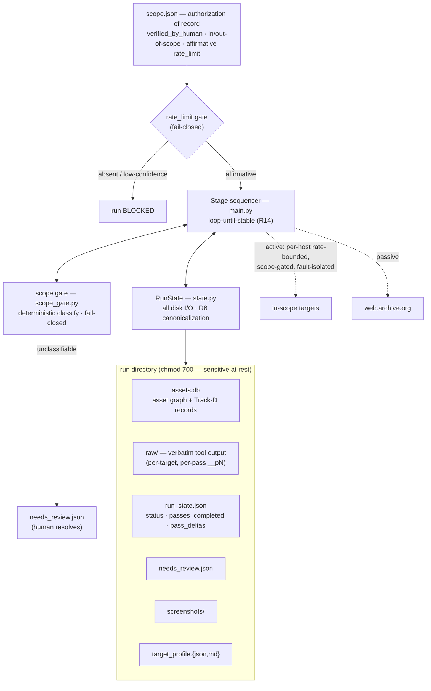
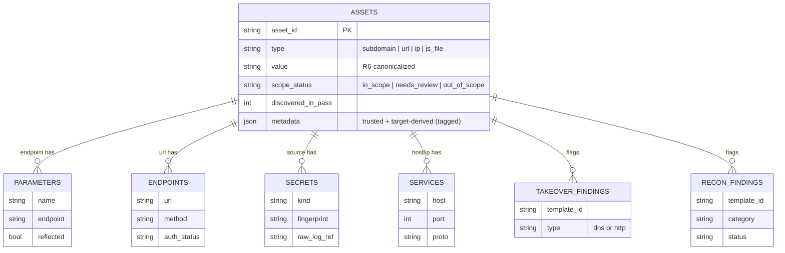

# Architecture & topology — sozin-recon

A visual map of what sozin-recon is, how a run flows, and what it produces.
sozin-recon is a **scripted, deterministic reconnaissance engine**: same input →
same behavior, **no LLM calls, no exploitation**. It discovers, enriches,
prioritizes, and flags an attack surface — it never tests, exploits, uses a
credential, or confirms a vulnerability.

> Diagrams are [Mermaid](https://mermaid.js.org/) and render on GitHub. For the
> stage/tool one-liner see [`../README.md`](../README.md); for the on-disk
> schema see [`STATE_SCHEMA.md`](STATE_SCHEMA.md); for the loop internals see the
> dev-local `design_docs/RECON_LOOP_DESIGN.md`.

---

## 1. System topology

The engine sits behind two fail-closed gates, reads/writes everything through a
single `RunState` I/O layer, and emits an inspectable run directory. Its only
network egress is scope-implied active traffic to in-scope targets (plus passive
reads of web.archive.org).

---

## 2. Pipeline flow — three phases

Execution is **loop-until-stable**: a one-shot pre-loop, a discovery loop that
repeats until the asset graph converges, then a run-once finalize phase over the
complete graph. Stage 2 is intentionally reserved/skipped; 4.5 and 6.5 are
fractional stages that slot between integers.

```mermaid
flowchart TD
    START([run start]) --> PRE

    subgraph PRE["PRE-LOOP — pass 1 only"]
        S1["Stage 1 · passive discovery<br/>subfinder · assetfinder · amass · gau · waybackurls · certspotter"]
    end
    PRE --> LOOP

    subgraph LOOP["LOOP — repeats until stable (each stage re-seeds from the full graph)"]
        direction TB
        S3["Stage 3 · active DNS + brute — alterx · puredns · dnsx"]
        S4["Stage 4 · live probing — httpx · naabu (+ service records)"]
        F5["F5 · reverse DNS — dnsx -ptr"]
        S5["Stage 5 · hidden params — paramspider (urls) + x8 (param records)"]
        S6["Stage 6 · crawl — katana"]
        S65["Stage 6.5 · content discovery — ffuf + SecLists (+ WAF flags)"]
        S7["Stage 7 · JS extraction — jsluice"]
        S3 --> S4 --> F5 --> S5 --> S6 --> S65 --> S7
    end

    LOOP --> GUARD{"convergence guard<br/>delta = new assets this pass"}
    GUARD -->|"still productive"| LOOP
    GUARD -->|"delta = 0 (fixed point)"| CONV["converged → status = stable"]
    GUARD -->|"pass cap or diminishing returns"| UNCONV["stop → status = stage_complete"]

    CONV --> FIN
    UNCONV --> D5["D5 · final x8 harvest<br/>(only if un-converged)"] --> FIN

    subgraph FIN["FINALIZE — once, over the converged graph"]
        direction TB
        F45["4.5 · WAF/CDN — cdncheck · wafw00f"]
        E4["E4 · secret classification (offline)"]
        S8["8 · nuclei takeover + C1 detection"]
        S9["9 · whatweb fingerprint"]
        C2["C2 · screenshots — httpx system-chrome"]
        C5["C5 · tech→CVE candidates (offline)"]
        S10["10 · API-schema — OpenAPI/Swagger · GraphQL introspection"]
        S11["11 · archived-JS mining — Wayback CDX → jsluice (passive)"]
        C4["C4 · auth-surface classification (offline)"]
        F1["F1 · URL clustering (offline)"]
        A2["A2 · interest scoring (offline)"]
        F6["F6 · target-profile digest (offline)"]
        F45 --> E4 --> S8 --> S9 --> C2 --> C5 --> S10 --> S11 --> C4 --> F1 --> A2 --> F6
    end
    FIN --> DONE([run complete])
```

**Why this shape:**
- **Stage 1 is pre-loop** — it seeds only from the (constant) root domains, so
  re-running it would add only non-deterministic CT/OSINT flap, not real
  discovery.
- **The loop closes the one-pass coverage gap** — x8 (stage 5) runs *before*
  6/6.5/7, so endpoints those stages surface would never be param-fuzzed in a
  single pass. Looping re-seeds x8 with the full URL graph (validated ~3.3–3.65×
  more parameters).
- **Finalize runs once** — 4.5/8/9/C2/10/11 and the offline finalizers are
  metadata/finding/terminal producers with no downstream loop consumer, so they
  run once over the complete graph.

### 2a. Convergence guard (R14) & frontier seeding (L3)

- **`delta`** counts genuinely-new **assets** added in a pass (Track-D records
  don't count — they don't create new seeds). It is R6-canonicalized and deduped.
- **Terminate when:** `delta == 0` → `stable` (a true fixed point); else the hard
  pass cap (`run_options.max_passes`, default 4) or the diminishing-returns floor
  `max(3, 2% × graph)` → `stage_complete`. Cap + floor are the non-determinism
  backstops (passive/DNS sources vary, so `delta == 0` may never fire on its own).
- **Frontier seeding (L3):** on pass ≥ 2 each target-facing stage processes only
  its *unprocessed* units (per-unit "processed in pass N" markers on the asset),
  so the expensive per-host stages (4/6/6.5) run once, not once per pass —
  identical discovery, ~half the time and target traffic. Safe because each
  stage's per-unit output is a pure function of that unit + the live target
  (independent of the rest of the graph).

---

## 3. Stage → tool → output catalog

| Stage | Phase | Tool(s) | Produces |
|---|---|---|---|
| 1 passive discovery | pre-loop | subfinder, assetfinder, amass, gau, waybackurls, certspotter | subdomain + url assets |
| 3 active DNS + brute | loop | alterx, puredns, dnsx | subdomain assets |
| 4 live probing | loop | httpx, naabu | live-host metadata, ip assets, **service** records |
| F5 reverse DNS | loop | dnsx -ptr | subdomain assets (from IPs) |
| 5 hidden params | loop | paramspider, x8 | url assets (paramspider) + **parameter** records (x8) |
| 6 crawling | loop | katana | url assets (incl. `.js`) |
| 6.5 content discovery (B1) | loop | ffuf + SecLists | url assets + **endpoint** records + per-host WAF flags |
| 7 JS extraction | loop | jsluice | url assets + **endpoint/parameter/secret** records |
| 4.5 WAF/CDN (C3) | finalize | cdncheck, wafw00f | host metadata (waf/cdn/cloud) |
| E4 secret classification | finalize | offline | secret kind/provider labels |
| 8 takeover + detection | finalize | nuclei | **takeover_findings** (dns/http) + **recon_findings** (C1) |
| 9 tech fingerprint | finalize | whatweb | host metadata (tech versions) |
| C2 screenshots | finalize | httpx system-chrome | per-host screenshot paths |
| C5 tech→CVE | finalize | offline | **recon_findings** (cve-candidate) |
| 10 API-schema (B2a) | finalize | OpenAPI/Swagger, GraphQL introspection | url assets + endpoint/parameter records |
| 11 archived-JS (B4) | finalize | Wayback CDX → jsluice | url assets + endpoint/parameter/secret records |
| C4 auth-surface | finalize | offline | endpoint `auth_status` + host `auth_model` |
| F1 URL clustering | finalize | offline | representative-sample flags on templated URL floods |
| A2 interest scoring | finalize | offline | ranked attack surface |
| F6 target-profile digest | finalize | offline | `target_profile.{json,md}` summary |

Every active-traffic stage is scope-gated, per-host rate-bounded, and
fault-isolated (one tool failing never kills the run). Stage 11 is *passive
toward the target* — it reads web.archive.org, not the host.

---

## 4. Data model

Everything lands in `assets.db` (SQLite). The **asset graph** is the spine; the
**Track-D source records** hang off it, and two findings tables carry flagged
leads. All rows carry provenance (`discovered_at_stage`, `discovered_in_pass`,
`discovered_by`).

- **Never store a raw secret** — `secrets` holds a capped `fingerprint` +
  `raw_log_ref` pointing into the chmod-700 `raw/` archive, never the value.
- **Two-tier persistence** — raw bytes hit `raw/` verbatim first; the curated
  DB layer is derived from them, so re-deriving never re-touches the target.
- **Provenance split (R9)** — attacker-influenceable metadata keys are tagged
  (`TARGET_DERIVED_METADATA_KEYS`) so a downstream consumer knows what to distrust.

---

## 5. Cross-cutting invariants

- **Fail closed.** Unclassifiable scope → `needs_review.json`; an absent or
  low-confidence rate limit → the run is blocked, never guessed.
- **Caller filters, stage consumes.** Each stage receives a caller-filtered seed
  from the full graph and returns assets-or-metadata; the sequencer owns scope
  classification, DB writes, and the shared report tail. This is what makes the
  standalone single-stage re-runners share exact logic.
- **Target courtesy is per-host.** The rate subsystem distinguishes target-facing
  traffic from DNS-resolver/archive traffic and refuses to throttle the latter to
  the former's rate.
- **Fault isolation (R7).** A single tool/host failure is logged and skipped; an
  unhandled exception marks `run_state` `error` with the failing stage.
- **The recon/primitive boundary.** recon *classifies and prioritizes*; a
  separate downstream agent *tests and validates*. This is why recon never
  validates a secret, confirms a takeover, or engages a WAF — findings are
  unconfirmed candidates for review (e.g. `validated` is left unset for the
  downstream consumer).
- **Deterministic by construction — at the code-path level (R14).** The logic is
  LLM-free and behaves identically on identical input; results still vary
  run-to-run because passive sources, CT logs, DNS, and timing do — which is why
  the loop's termination is a cap + diminishing-returns cutoff, not convergence
  alone.
